# AS-Teams-Integration

Author: Accelerynt

For any technical questions, please contact info@accelerynt.com  

       

This playbook is intended to be run from a Microsoft Sentinel incident. It will create a post in a Teams channel with the related Microsoft Sentinel incident and entity information.
                                                                                                                                     
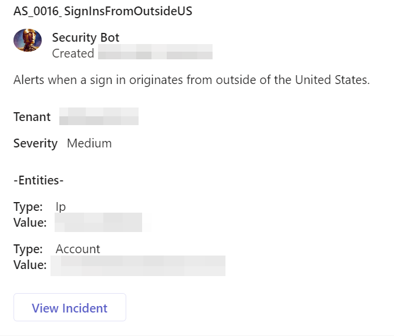
                                                                                                                                     
                                                                                                 
#
### Deployment                                                                                                         
                                                                                                        
To configure and deploy this playbook:
 
Open your browser and ensure you are logged into your Microsoft Sentinel workspace. In a separate tab, open the link to our playbook on the Accelerynt Security GitHub Repository:

https://github.com/Accelerynt-Security/AS-Teams-Integration

                                             

Click the “**Deploy to Azure**” button at the bottom and it will bring you to the custom deployment template.

In the **Project Details** section:

* Select the “**Subscription**” and “**Resource Group**” from the dropdown boxes you would like the playbook deployed to.  

In the **Instance Details** section:   

* **Playbook Name**: This can be left as “AS-Teams-Integration” or you may change it.  

Towards the bottom, click on “**Review + create**”. 

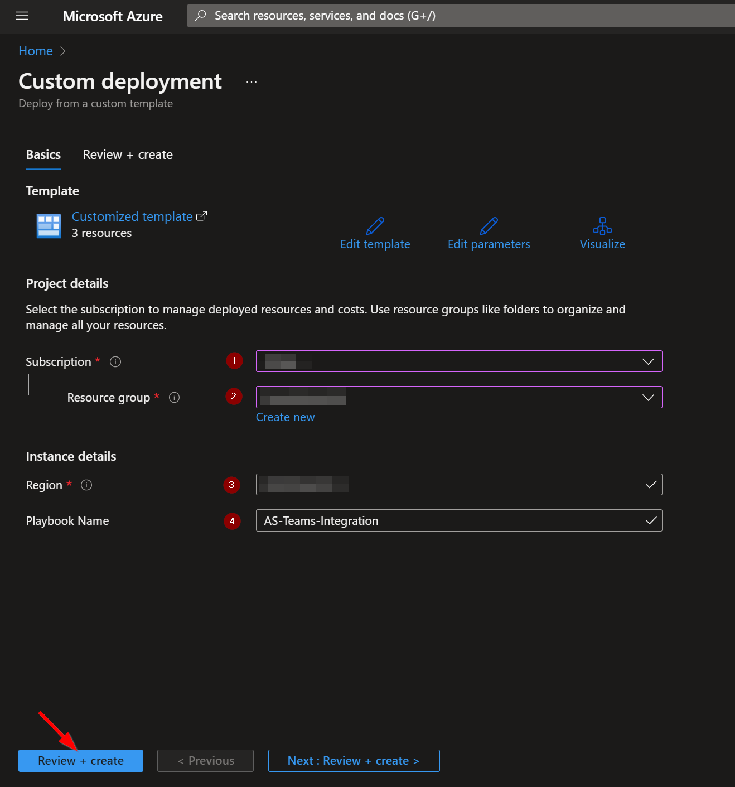

Once the resources have validated, click on "**Create**".

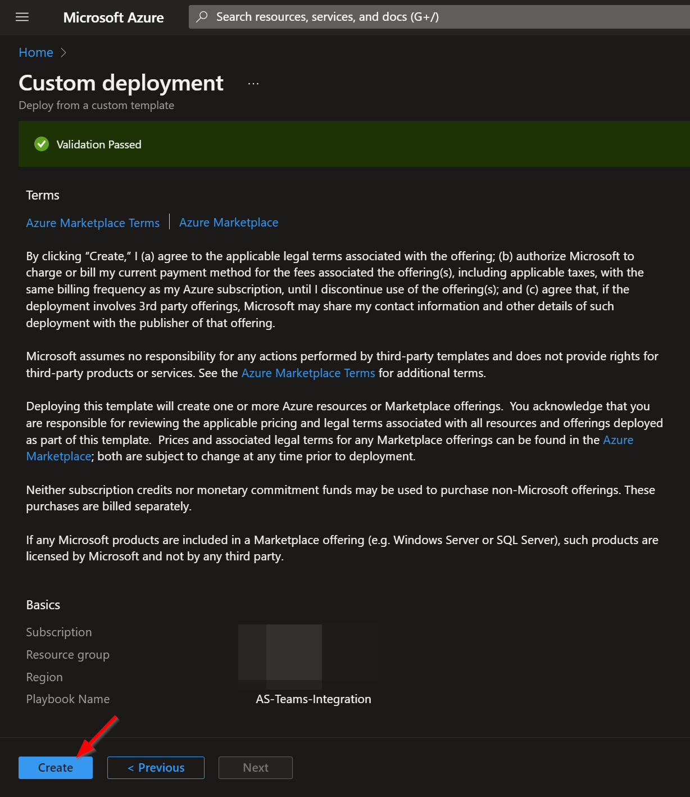

The resources should take around a minute to deploy. Once the deployment is complete, you can expand the "**Deployment details**" section to view them.
Click the one corresponding to the Logic App.

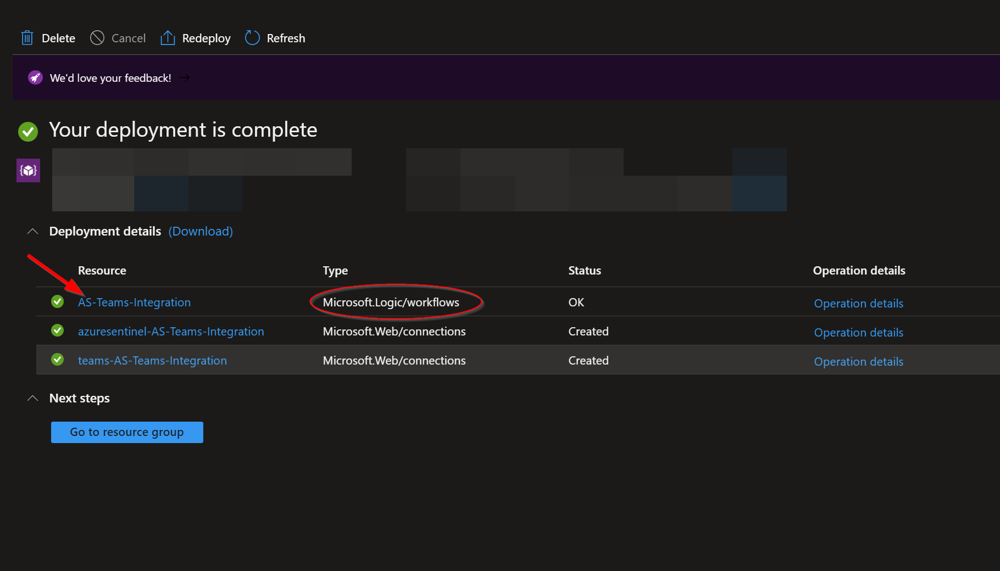

Click on the “**Edit**” button. This will bring us into the Logic Apps Designer.

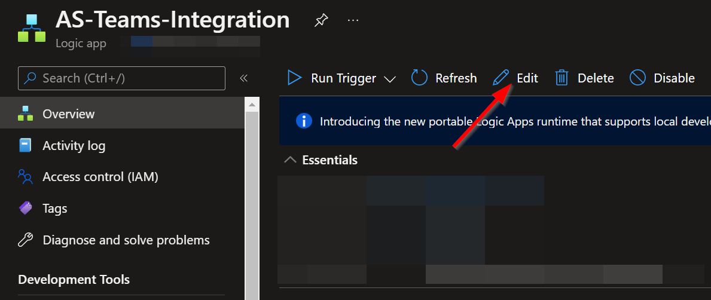

The first and fourth steps labeled "**Connections**" use connections created during the deployment of this playbook. Before the playbook can be run, each connection will either need to be authorized, or an existing authorized connection may be alternatively selected.  

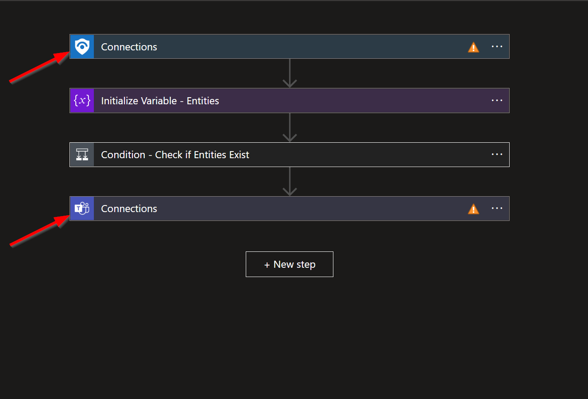

To validate the connection created for this playbook, expand a "**Connections**" step and click the exclamation point icon next to the name matching the playbook.
                                                                                                
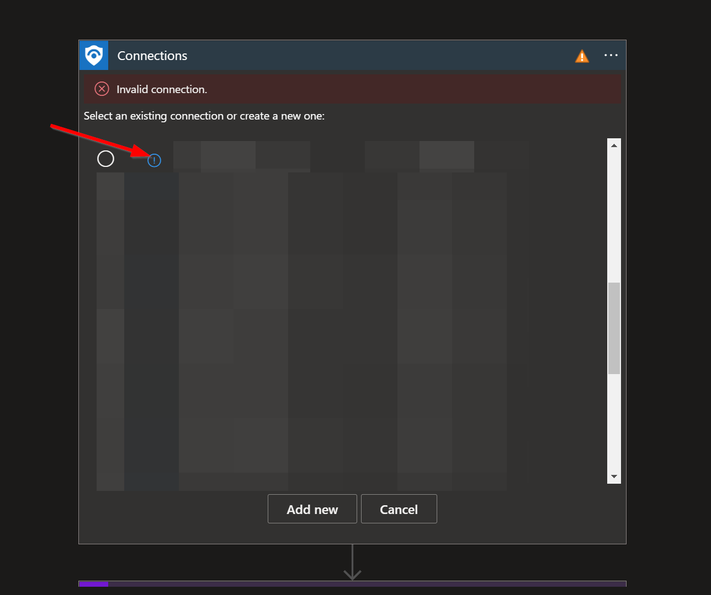

When prompted, sign in to validate the connection.                                                                                                
                                                                                                
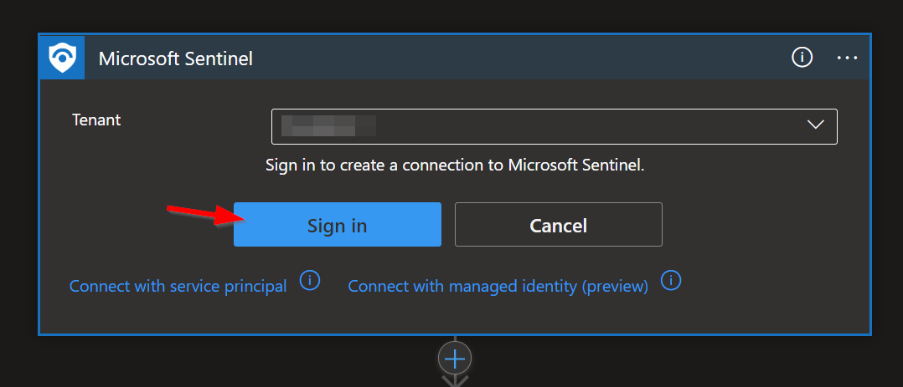                                                                                                                                                                                                                                                   
After the Teams connection has been validated, the team and channel will need to be selected.

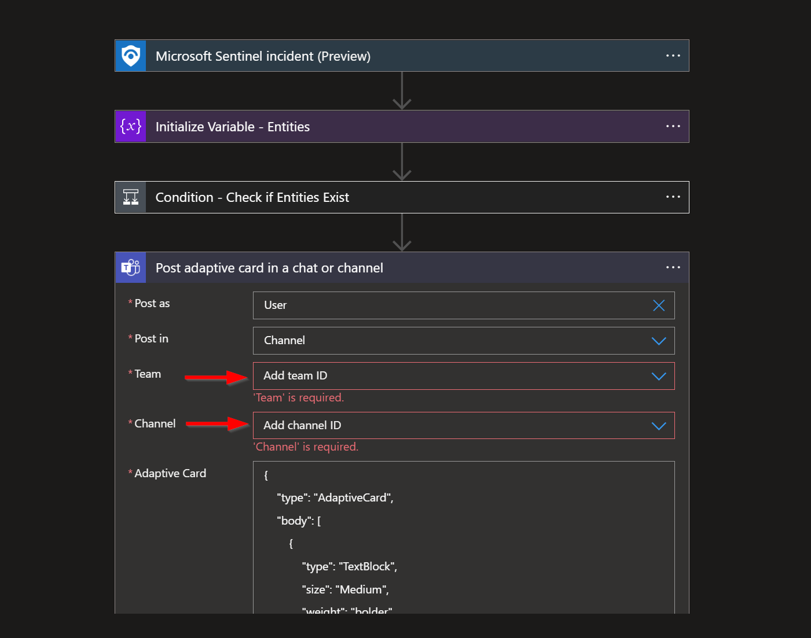  

Once this is complete, save the playbook.

#
### Running the Playbook
To run this playbook automatically on incidents in Microsoft Sentinel, navigate to "**Automation**" under "**Configuration**" in the left-hand menu.

Click the "**Create**" button and select "**Automation Rule**" option from the dropdown.

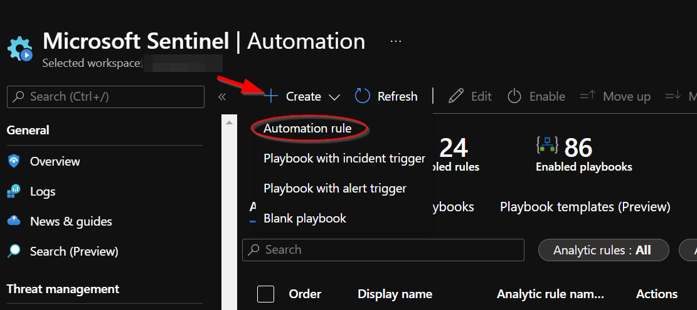

**1)** Enter a name for the automation rule. 

**2)** Then stipulate the conditions for which you would like a Microsoft Sentinel Incident to be sent to Teams. In the example below, criteria are set so that only incidents with high severity will be sent to Teams. 

**3)** Select the "**Run Playbook**" option under the "**Actions**" section. 

**4)** Then select the name of the playbook that was just deployed from this page. 

**5)** Review the default values under the "**Rule expiration**" and "**Order**" section, then click Apply.

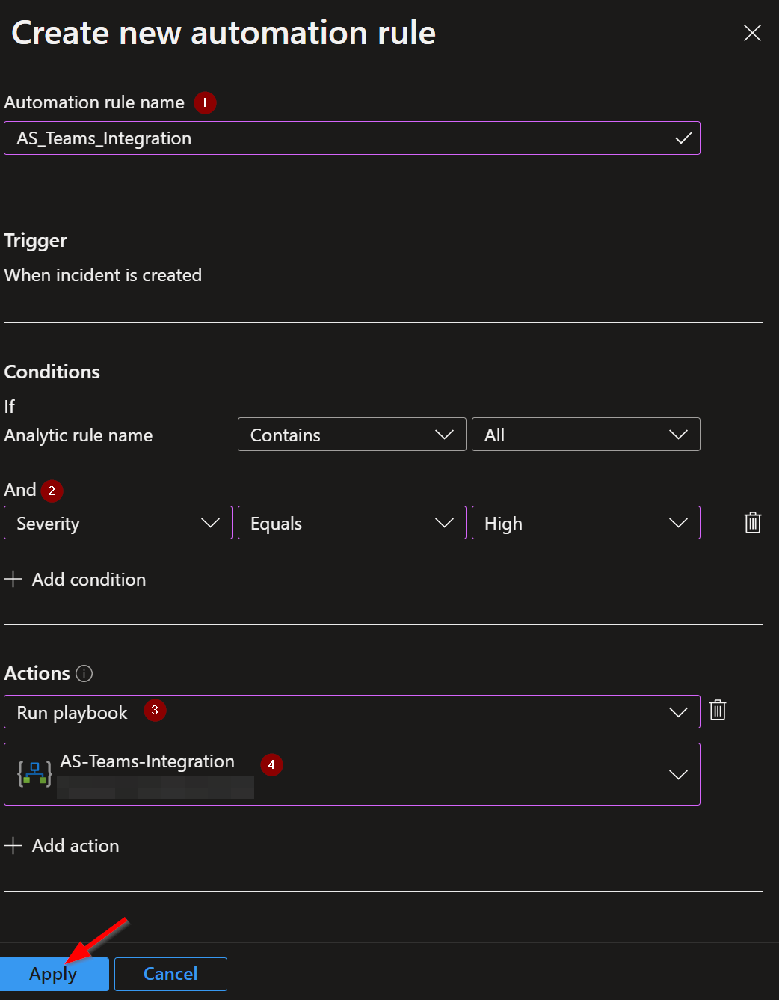

Once this saves, your new integration should run automatically.
